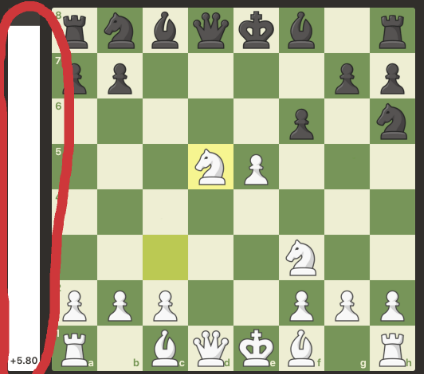
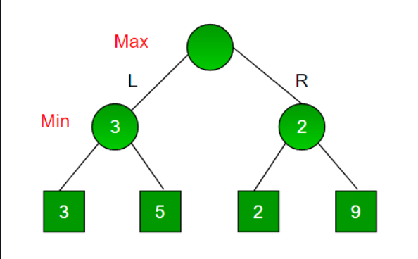
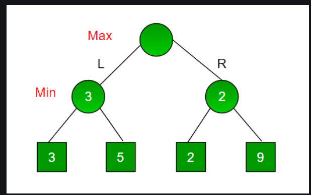

# MiniMax algorithm

Minimax is a backtracking algorithm used in decision making and game theory to find the optimal move for a player, assuming that the opponent also plays optimally. It is applied on 2-player games, in which each player has complete information (for example they can see the whole board).

Example of games in which this algorithm can be applied:

- Chess
- Tic-Tac-Toe
- Connect 4

The algorithm involves two players: player *MAX* (who wants to win the game) and player *MIN* (who wants to prevent MAX to win the game by winning himself). For example, in chess, MAX is white and MIN is black.

Each game state is evaluated using an evaluation function and is assigned a numerical value based on the game situation. For example, the evaluation bar on chess.com shows the value returned by the evaluation function on that specific position. If the value is greater than 0 (or the bar has more white than black), then white (MAX) has a better chance of winning. Similarly, if the value if less than 0, then black (MIN) has a better chance of winning. 

**How the algorithm works:**

*Step 1*: Creates a tree structure, where the leaves of the tree are the final states of the game being played, or if the game is too long (like chess), the maximum depth allowed. (for example, when a player has completed a line in Tic-Tac-Toe, or when the board is full).

*Step 2*: Calculates the evaluation for all of the leaves using the evaluation function.

*Step 3:* Backtracks and calculates the evaluation of all the nodes by taking the minimum/maximum of the evaluations of the current node's children, depending on whose move it is at that time.

   -------------------->        

*Step 4:* Choose the move.

