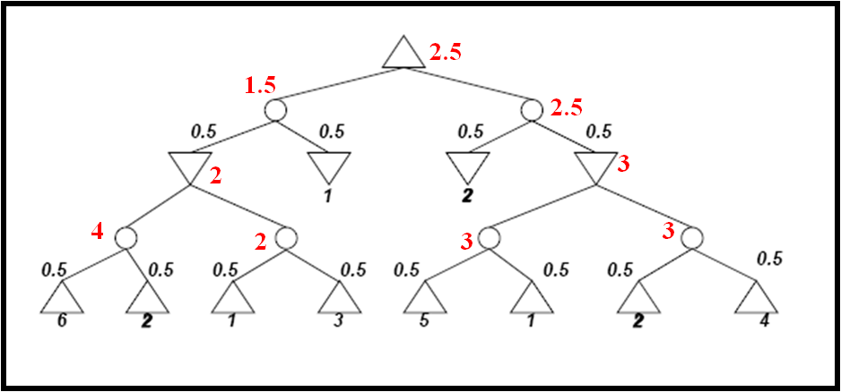

# MiniMax algorithm

Minimax is a backtracking algorithm used in decision making and game theory to find the best move for a player, assuming that the opponent also plays optimally. It is applied on 2-player games, in which each player has complete information (for example they can see the whole board and the opponent has no hidden game parts, like hidden cards).

Example of games in which this algorithm can be applied:

- Chess
- Tic-Tac-Toe
- Connect 4

The algorithm involves two players: player *MAX* (who wants to win the game) and player *MIN* (who wants to prevent MAX to win the game by winning himself). The player *MAX* is always the first player that makes a move. For example, in chess, MAX is white and MIN is black.

Each game state is evaluated using an evaluation function and is assigned a numerical value based on the game situation. For example, the evaluation bar on chess.com shows the value returned by the evaluation function on that specific position. If the value is greater than 0 (or the bar has more white than black), then white (MAX) has a better chance of winning. Similarly, if the value if less than 0, then black (MIN) has a better chance of winning. 


**How the algorithm works:**

*Step 1*: Creates a tree structure, where the leaves of the tree are the final states of the game being played, or if the game is too long (like chess), the maximum depth allowed. (for example, when a player has completed a line in Tic-Tac-Toe, or when the board is full).

*Step 2*: Calculates the evaluation for all of the leaves using the evaluation function.

*Step 3:* Backtracks and calculates the evaluation of all the nodes by taking the minimum/maximum of the evaluations of the current node's children, depending on whose move it is at that time.

   -------------------->        

*Step 4:* Choose the move. In the tree above, it chooses the left branch, as it is MAX's move and 3 > 2.

**Python Implementation**

```python
def minimax (curDepth, nodeIndex,
             maxTurn, scores, 
             targetDepth):

    # base case : targetDepth reached
    if (curDepth == targetDepth): 
        return scores[nodeIndex]
    
    if (maxTurn):
        return max(minimax(curDepth + 1, nodeIndex * 2, 
                    False, scores, targetDepth), 
                   minimax(curDepth + 1, nodeIndex * 2 + 1, 
                    False, scores, targetDepth))
    
    else:
        return min(minimax(curDepth + 1, nodeIndex * 2, 
                     True, scores, targetDepth), 
                   minimax(curDepth + 1, nodeIndex * 2 + 1, 
                     True, scores, targetDepth))
```

The time complexity of this algorithm is $O(b^m)$, where *b* is the number of possible moves for a player at a certain state and *m* is the maximum depth of the tree.

The space complexity of this algorithm is $O(b*m)$, where *b* and *m* have the same meaning as above.

*Remark*: It is almost impossible to compute the entire tree for a complex game like chess, so we need to find a better implementation of the idea of this algorithm.

# An efficient MiniMax implementation: Alpha-Beta pruning

The MiniMax algorithm generates the entire state tree until the depth limit is reached or the game ends, whichever comes first, which takes a lot of time. 

*Observation*: In the MiniMax algorithm, not all of the nodes of the tree are used to compute the best move at the current state of the game, so we want to stop looking at all of them to improve the complexity of the algorithm.

**How the algorithm works:**

To make MiniMax more efficient, Alpha-Beta Pruning cuts some of the tree's branches that will have no effect on the evaluation of the current state. It uses two extra parameters:

- alpha ($\alpha$), which is the highest score (evaluation) that player *MAX* is guaranteed to get so far
- beta ($\beta$), which is the lowest score (evaluation) that player *MIN* is guaranteed to get so far

When $\alpha \ge \beta$, the branch is cut (or pruned).

At the begining, the algorithm initializes $\alpha = -\infty$ and $\beta = \infty$ and performs a DFS (similar to MiniMax). Then, MAX nodes update $\alpha$ when he finds a child node which value is greater than $\alpha$ and MIN nodes update $\beta$ when he finds a child node which value is less than $\beta$. If a min node receives a $\beta$ value less than or equal to the $\alpha$ value of its ancestor, it stops evaluating its children (pruning).

You can practice your understanding of this algorithm <a href = https://schaerli.org/info2/abTreePractice/>here</a>.

**Python Implementation**

```python
import numpy as np

class Node:
    def __init__(self, move_name=None, value=None, children=None):
        self.move_name = move_name
        self.value = value
        self.children = children if children is not None else []

    def is_terminal(self):
        return len(self.children) == 0

    def evaluate(self):
        return self.value

def alpha_beta(node, depth, alpha, beta, is_MAX_turn):
    # Returns a tuple: (best_move_node, evaluation_score)
    if depth == 0 or node.is_terminal():
        return None, node.evaluate()

    best_move = None

    if is_MAX_turn:
        max_eval = -np.inf
        for child in node.children:
            _, eval_score = alpha_beta(child, depth - 1, alpha, beta, False)
            
            if eval_score > max_eval:
                max_eval = eval_score
                best_move = child
                
            alpha = max(alpha, eval_score)
            if beta <= alpha:
                break  # Beta cutoff
        return best_move, max_eval

    else:
        min_eval = np.inf
        for child in node.children:
            _, eval_score = alpha_beta(child, depth - 1, alpha, beta, True)
            
            if eval_score < min_eval:
                min_eval = eval_score
                best_move = child
                
            beta = min(beta, eval_score)
            if beta <= alpha:
                break  # Alpha cutoff
        return best_move, min_eval
```

The time complexity of this algorithm is in the best case $O(b^{\frac{m}{2}})$, so way better than MiniMax's complexity. If no subtrees are pruned, then the complexity is still $O(b*m)$ and the algorithm is completely identical to MiniMax. The space complexity is $O(d)$, so better than MiniMax's.


# Expectiminimax Algorithm

We have previously looked at algorithms where both players have complete information about the game state. Now, we are going to look at an algorithm which is used for games where there occur some random events besides the player moves (for example Backgammon).

Unlike the MiniMax algorithm, Expectiminimax has 3 types of nodes:

- MAX nodes: the agent selects the action that yields the highest value of the evaluation function (just like before)
- MIN nodes: the agent selects the action that yields the lowest value of the evaluation function (just like before)
- CHANCE nodes: represents a random event (like a dice roll). The value of it is calculated as the sum of the value of each child multiplied by its probability of occurring.

Expectiminimax works in the same way as MiniMax, but it calculates the values using the three types of nodes stated above, instead of the two types from MiniMax.

*Remark*: The algorithm that solves 1-player games that includes random events is the **Expectimax** algorithm. It works in the exact same way as Expectiminimax, but it treats the MIN nodes as MAX nodes instead.

**Python implementation**:

```python
class NodeType:
    MAX = 'MAX'
    MIN = 'MIN'
    CHANCE = 'CHANCE'
    TERMINAL = 'TERMINAL'

class Node:
    def __init__(self, node_type, value=None, probability=1.0):
        self.node_type = node_type
        self.value = value
        self.probability = probability
        self.children = []

    def add_child(self, child_node):
        self.children.append(child_node)

def expectiminimax(node, depth):
    # Base case: Reached depth limit or a terminal node
    if depth == 0 or node.node_type == NodeType.TERMINAL:
        return node.value

    if node.node_type == NodeType.MAX:
        return max(expectiminimax(child, depth - 1) for child in node.children)

    elif node.node_type == NodeType.MIN:
        return min(expectiminimax(child, depth - 1) for child in node.children)

    elif node.node_type == NodeType.CHANCE:
        expected_value = 0.0
        for child in node.children:
            expected_value += child.probability * expectiminimax(child, depth - 1)
        return expected_value
```
The time complexity is $O(b^m)$ and the space complexity is $O(b*m)$, the same as MiniMax.

**Example**:


